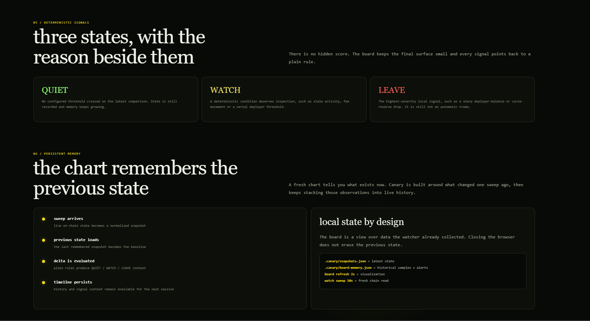
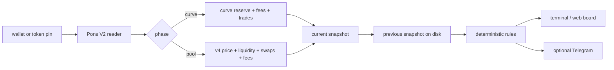

# Canary v0.4


[](https://usecanary.watch)


**A read-only watchtower for Pons V2 positions on Robinhood Chain.**

Canary watches what happens **after the buy**. It reads the chain, stores snapshots, compares one sweep with the next, and turns deterministic changes into `QUIET`, `WATCH`, or `LEAVE` signals.

> **No key. No signer. No transaction path.** Canary can read and compare state, but it cannot move funds.

**Live:** [usecanary.watch](https://usecanary.watch)  
**Created by:** [@gippp69](https://x.com/gippp69)

---

## What v0.4 does

Canary follows both sides of a Pons V2 launch lifecycle instead of pretending one metric means the same thing everywhere.

**On the bonding curve it reads:**

- deployer token share
- real quote reserve
- pending curve fees
- recent `CurveBuy` / `CurveSell` activity
- launch phase and deployer history

**After graduation it switches to Uniswap v4 pool state:**

- pool price / tick
- active liquidity
- recent swaps
- pending token / quote fees
- pool activity and phase changes

Every sweep is normalized into a snapshot. The next sweep is compared against the previous one using plain deterministic rules.

---

## Public site

[**Open Canary → usecanary.watch**](https://usecanary.watch)

The public site is the easiest way to inspect Canary without installing anything. Paste a Pons V2 token address into the scanner and Canary performs a read-only chain snapshot.

The public surface also shows live RPC / chain state and explains how Canary remembers changes between sweeps.

Persistent watcher control stays protected. The public site does not expose a signer, wallet import, private-key field, or transaction path.

> A one-shot public scan shows **current state**. `WATCH` / `LEAVE` change signals require a previous snapshot to compare against.

---

## Live desk



For a local persistent watcher:

```bash
npm install
npm run board -- --open
```

Then paste a Pons V2 token address into the board. Canary validates it, performs repeated read-only sweeps, remembers snapshots under `.canary/`, and restores the local watchlist after restart.

Inside the desk you can inspect:

- RPC health and latest Robinhood Chain block
- deployer share and launch history
- curve reserve or pool price
- trades / swaps and last activity
- quote and token fee state
- phase changes
- live history charts
- before → after signal deltas
- per-sweep event history

The current board screenshot will be refreshed separately as the public UI evolves.

---

## Quick start

```bash
git clone https://github.com/Gipppp121/canary.git
cd canary
npm install

# safest first look: offline fixtures
npm run canary -- watch --demo --board

# verify RPC, chain id and factory
npm run canary -- doctor --probe

# scan one exact Pons V2 token
npm run canary -- scan 0xTOKEN

# watch one exact token
npm run canary -- watch --token 0xTOKEN --board --interval 10
```

Watch recent Pons V2 positions held by a wallet:

```bash
npm run canary -- watch 0xYOUR_WALLET --board --interval 10
```

---

## Signals

`QUIET` means no deterministic threshold crossed.  
`WATCH` means inspect the measured change.  
`LEAVE` is Canary's highest-severity local signal.

None of them is a trade instruction.

Current v0.4 rules include:

```text
LEAVE  deployer-balance-drop     deployer token balance fell between sweeps
LEAVE  curve-reserve-drop        real quote reserve fell sharply on the curve
LEAVE  pool-liquidity-drop       active pool liquidity fell beyond threshold

WATCH  fees-swept                pending curve fees moved
WATCH  volume-dead               no recent curve activity was observed
WATCH  serial-deployer           deployer has many launches in the index window
WATCH  pool-price-move           pool price moved beyond threshold
WATCH  pool-token-fees-moved     pending token fee state moved
WATCH  pool-swap-burst           recent pool swaps crossed burst threshold

INFO   phase-change              curve / swept / pool / rescued routing changed
```

The rule names are intentionally literal. Canary reports what it can prove from the reads it performs; it does not infer intent.

Full rule reference: [`docs/RULES.md`](docs/RULES.md).

---

## How it works



There is no model in the alert path. The same reads and thresholds produce the same rule result.

---

## Persistent memory

Local state lives under `.canary/`:

```text
.canary/snapshots.json      latest token state
.canary/board-memory.json   historical samples and alerts
.canary/watchlist.json      tokens resumed after board restart
```

This is what lets Canary compare **before → after** instead of judging one isolated number.

---

## RPC fallback

Default Robinhood Chain RPC:

```text
https://rpc.mainnet.chain.robinhood.com
```

Optional fallback endpoints can be supplied through `RPC_FALLBACK_URLS`. Canary remembers the last working endpoint and tries fallbacks when the preferred RPC fails.

Public RPCs can rate-limit large log requests, so Canary chunks scans and keeps unknown history unknown rather than inventing data.

---

## Configuration

Copy `.env.example` to `.env` for persistent local configuration.

Important values:

```bash
RPC_URL=https://rpc.mainnet.chain.robinhood.com
RPC_FALLBACK_URLS=
PONS_V2_FACTORY=0x7eD598BcEf8bd9Edd8C97A195C6d13f40801EC7e

WALLETS=
TOKENS=
POLL_SECONDS=45

DEV_SELL_PCT=2
LIQUIDITY_DROP_PCT=15
VOLUME_DEAD_MINUTES=30
SERIAL_DEPLOYER_COUNT=12

POOL_LIQUIDITY_DROP_PCT=20
POOL_PRICE_MOVE_PCT=25
POOL_SWAP_BURST_COUNT=20
```

For a public reverse-proxied board, watcher start / stop control can be protected with:

```bash
CANARY_CONTROL_TOKEN=...
```

The public one-shot scanner remains read-only and separate from persistent watcher control.

---

## Commands

```text
canary doctor [--probe]             config + live RPC/factory probe
canary rules                        list deterministic rules
canary watch [wallets...]           continuous wallet watch
canary watch --token <token...>     exact token watch
canary watch --once                 one sweep and exit
canary watch --demo                 fixtures, no network
canary scan <token>                 live Pons V2 snapshot, no state mutation
canary check --dev-was --dev-now    test one rule offline
canary positions                    locally remembered snapshots
```

From a clone:

```bash
npm run canary -- <command>
```

---

## Read-only by construction

Canary refuses signing material such as:

```text
PRIVATE_KEY
SECRET_KEY
MNEMONIC
SEED_PHRASE
WALLET_PRIVATE_KEY
```

The project also checks source code for common transaction-writing / signing primitives.

The intended failure mode is boring: if Canary cannot read something, it should report an error or unknown state — never move funds.

---

## What Canary does not do

- no buy / sell / approve / claim transactions
- no private-key or seed import
- no wallet execution path
- no intent inference
- no promise that a `WATCH` or `LEAVE` event predicts price
- no fake lifetime volume when only a bounded activity window is available
- no conversion of unavailable RPC data into made-up certainty

See [`docs/LIMITATIONS.md`](docs/LIMITATIONS.md).

---

## Tests

```bash
npm run typecheck
npm test
npm run build
npm run canary -- watch --demo
```

CI builds the package, runs the deterministic test suite, smoke-tests the compiled CLI, and checks that signing / write primitives do not appear in `src/`.

---

## Docs

- [`docs/BOARD.md`](docs/BOARD.md) — board fields and behavior
- [`docs/RULES.md`](docs/RULES.md) — deterministic signals
- [`docs/ARCHITECTURE.md`](docs/ARCHITECTURE.md) — reader / memory / rule architecture
- [`docs/LIMITATIONS.md`](docs/LIMITATIONS.md) — explicit limits
- [`docs/V04.md`](docs/V04.md) — v0.4 changes

---

## License

MIT.

Canary is independent of Robinhood, Pons and Uniswap and is not endorsed by them.
