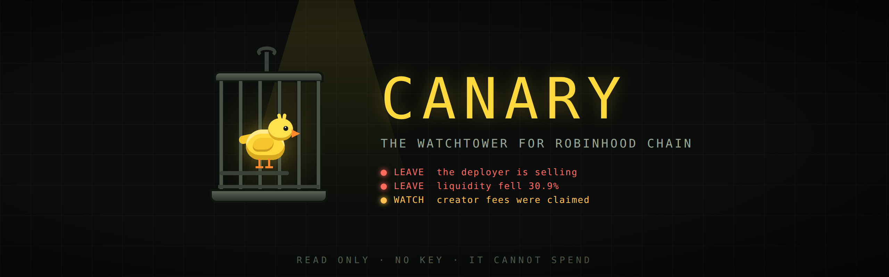

# canary




**A read-only watchtower for Pons V2 positions on Robinhood Chain.**

Most chain tools help you enter. Canary is for after the buy: watch the token, compare deterministic snapshots, and wake a human when something materially changes.

It has no wallet client, no account import, no transaction writer, and no place to put a private key.

---

## What works in v0.2

Canary now has a real Robinhood Chain reader instead of demo-only plumbing.

- verifies chain id `4663` and the configured Pons V2 factory with `doctor --probe`
- indexes recent `TokenLaunched` events from the Pons V2 factory
- discovers recent Pons V2 tokens held by a wallet
- accepts explicit token pins for older launches or exact monitoring
- reads the Pons V2 launch record, curve phase, deployer, pair asset and creator tax
- reads deployer token balance as a share of supply
- reads `realQuoteReserve`, pending curve fees and recent curve trades while phase = `curve`
- persists snapshots across restarts
- deduplicates repeated alerts
- optionally mirrors the same alerts to Telegram

No model is in the alert path. Every rule is a plain function in `src/watch/signals.ts`.

---

## Start with one token

```bash
git clone https://github.com/Gipppp121/canary.git
cd canary
npm install

# offline demo first
npm run canary -- watch --demo

# touch the real chain and verify the configured Pons V2 factory
npm run canary -- doctor --probe
```

Watch recent Pons V2 positions held by one wallet:

```bash
npm run canary -- watch 0xYourWallet --once
```

For an exact token, bypass wallet discovery completely:

```bash
npm run canary -- watch --token 0xTokenAddress --once
npm run canary -- scan 0xTokenAddress
```

For a long-running watcher, remove `--once`.

---

## The rules

```
LEAVE  deployer-balance-drop    deployer token balance fell between sweeps
LEAVE  curve-reserve-drop       real quote reserve fell sharply on the curve
WATCH  fees-swept               pending curve fees moved out of the curve
WATCH  volume-dead              no recent CurveBuy / CurveSell was observed
WATCH  serial-deployer          same deployer has many launches in the index window
INFO   phase-change             curve → swept → pool → rescued routing changed
```

The names are intentionally literal.

`deployer-balance-drop` does **not** claim a sale happened. A balance drop can also be a transfer or burn. `fees-swept` does **not** claim the creator withdrew money; it only says pending fees left the curve balance. Canary reports what can be proven from the reads it performs.

More detail: [`docs/RULES.md`](docs/RULES.md).

---

## Why the Pons V2 reader is different

Pons V2 starts each launch on its own constant-product bonding curve, then moves it into a locked Uniswap v4 pool after graduation. Those are different venues, so Canary does not pretend one metric means the same thing in both phases.

While a launch is on the curve, Canary reads:

```
factory.getLaunchedToken(token)
curve.realQuoteReserve()
curve.quoteFeeBalance()
curve.creatorTaxBalance()
CurveBuy / CurveSell logs
token.balanceOf(deployer)
token.totalSupply()
```

When the launch leaves phase `0`, curve-reserve, curve-volume and curve-fee rules stop. The phase change still appears, and deployer balance + deployer history can keep being tracked.

That boundary prevents graduation itself from looking like a fake liquidity collapse.

---

## Wallet discovery

A plain EVM RPC does not have a native “give me every ERC-20 this wallet owns” method. Canary therefore uses a bounded strategy instead of making a fake promise:

1. index recent Pons V2 `TokenLaunched` events
2. take the newest `DISCOVERY_MAX_TOKENS` launches
3. check `balanceOf(wallet)` on those tokens
4. add any explicit `TOKENS=` pins

Defaults:

```
INDEX_LOOKBACK_BLOCKS=400000
DISCOVERY_MAX_TOKENS=250
LOG_CHUNK_BLOCKS=20000
```

If you bought an older launch, pin the token address with `TOKENS=` or `--token`. For large portfolios, use a provider with an indexed token-balance API and swap in a custom `Reader` implementation.

---

## Public RPC behavior

The default endpoint is Robinhood Chain's public mainnet RPC:

```
https://rpc.mainnet.chain.robinhood.com
```

It is rate-limited. Canary chunks factory log scans rather than asking for one enormous `eth_getLogs` range, and unknown trade history stays **unknown** instead of being converted into a false `volume-dead` alert.

For an always-on deployment, set `RPC_URL` to a provider endpoint such as Alchemy or QuickNode.

---

## Commands

```
canary doctor [--probe]             config + live RPC/factory probe
canary rules                        every deterministic alert rule
canary watch [wallets...]           continuous wallet watch
canary watch --token <token...>     exact token watch
canary watch --once                 one sweep and exit
canary watch --demo                 fixtures, no network
canary scan <token>                 live Pons V2 snapshot, no state mutation
canary check --dev-was --dev-now    test one balance-drop rule offline
canary positions                    locally remembered snapshots
```

From a cloned repo, use `npm run canary -- <command>`. `npm install` also builds `dist/`, so `node bin/canary.js <command>` works afterward.

---

## Read-only by construction

At startup, Canary refuses these environment variables if they contain anything:

```
PRIVATE_KEY
SECRET_KEY
MNEMONIC
SEED_PHRASE
WALLET_PRIVATE_KEY
```

The CI job also scans `src/` for common transaction-writing and signing APIs. This is defense in depth, not a magical security guarantee: review the source you actually run.

The intended failure mode is boring. If Canary breaks, it should miss a read or print an error — never move funds.

---

## Telegram

Optional and off by default:

```bash
TELEGRAM_TOKEN=...
TELEGRAM_CHAT_ID=...
```

Telegram delivery is best-effort. A Telegram outage never kills the local watcher.

---

## Configuration

Copy `.env.example` to `.env` if you want persistent config. Canary loads that file at startup with a tiny built-in parser; already-exported environment variables take precedence.

Important values:

```bash
RPC_URL=https://rpc.mainnet.chain.robinhood.com
PONS_V2_FACTORY=0x7eD598BcEf8bd9Edd8C97A195C6d13f40801EC7e
WALLETS=
TOKENS=
POLL_SECONDS=45

DEV_SELL_PCT=2
LIQUIDITY_DROP_PCT=15
VOLUME_DEAD_MINUTES=30
SERIAL_DEPLOYER_COUNT=12
```

The factory is configurable because protocol deployments can change. Verify it against current Pons documentation before relying on the tool.

---

## Architecture

```text
wallet / token pins
       │
       ▼
Pons V2 launch index ──► live read-only snapshot
                              │
                              ▼
                     previous snapshot on disk
                              │
                              ▼
                    deterministic rule compare
                         │              │
                         ▼              ▼
                      terminal       Telegram
```

Full notes: [`docs/ARCHITECTURE.md`](docs/ARCHITECTURE.md).

---

## What it does not do

- it does not buy, sell, approve, claim, sign or submit transactions
- it is not a rug detector and does not infer intent
- it does not reconstruct all Uniswap v4 post-graduation swap activity yet
- wallet auto-discovery is intentionally bounded on public RPC; pin old tokens explicitly
- public RPC rate limits can make log data unavailable; unknown data stays unknown
- an alert is evidence to inspect, not a trading instruction

See [`docs/LIMITATIONS.md`](docs/LIMITATIONS.md).

---

## Tests

```bash
npm test
npm run typecheck
npm run build
npm run canary -- watch --demo
```

CI runs on Node 20 and 22, builds the package, runs the deterministic suite, smoke-tests the compiled CLI, and fails if signing/write primitives appear in `src/`.

---

## Sources used for the live adapter

- Robinhood Chain developer docs: network id and public RPC
- Pons V2 docs: deployed factory, launch record, curve state and events
- `ponsdotdev/ponsfamily`: public Pons V2 contract source

Canary is independent of Robinhood, Pons and Uniswap and is not endorsed by them.

## License

MIT. Start with `watch --demo`, then `doctor --probe`, then one token you can verify manually.
